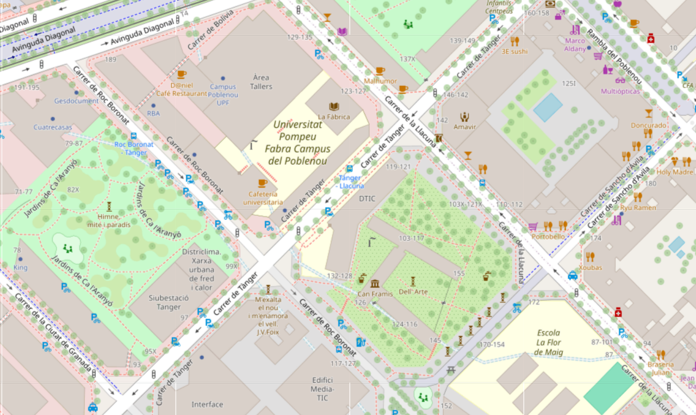
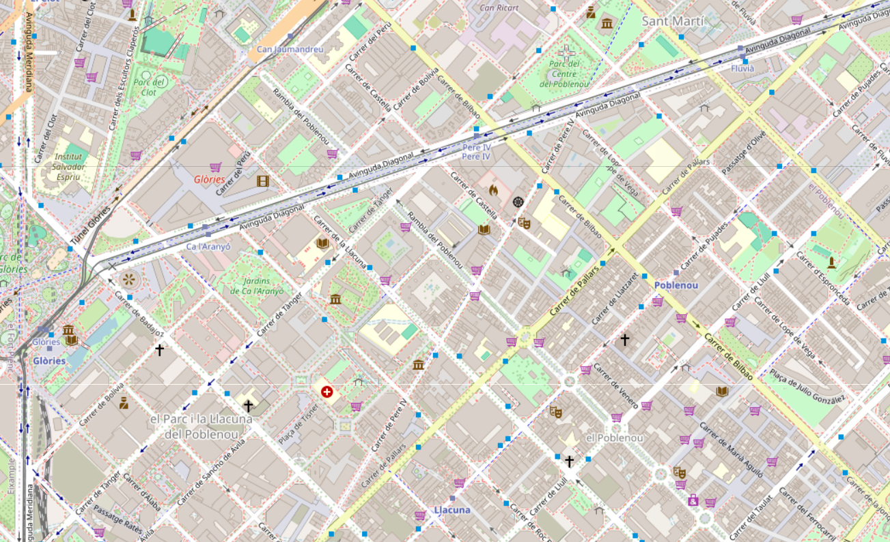
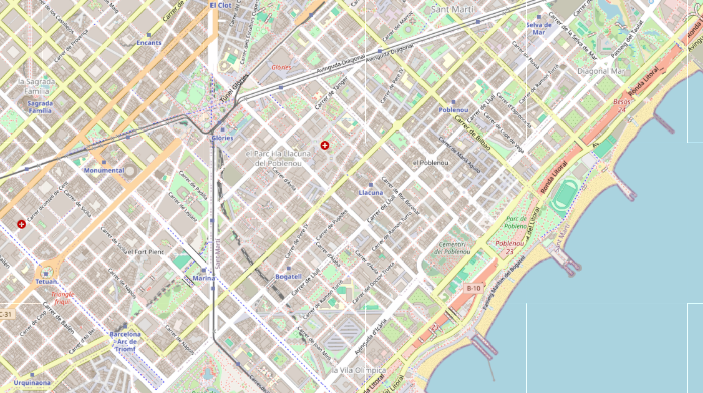
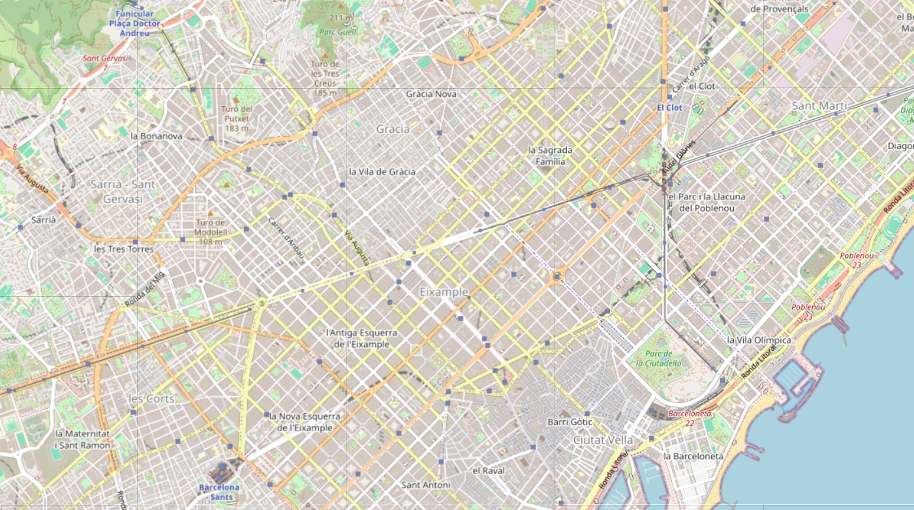
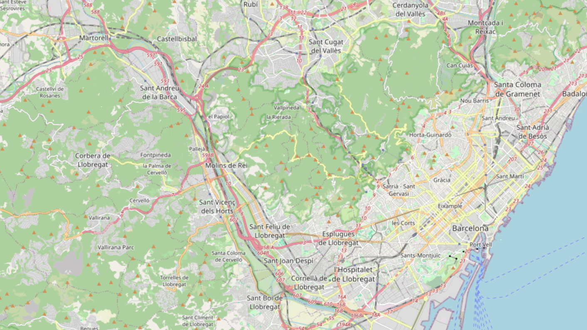

# Building Google Maps

`Data Structures and Algorithms - 2025 / 2026`

## Table of Contents

1. 🚀 [Goal](#goal)
2. 🗺️ [Introduction to maps](#introduction-to-maps)
3. 🏗️ [Design](#design)
4. 🧩 [Work breakdown](#work-breakdown)
   * 🛠️ [Lab 1: Developer Setup](#lab-1-developer-setup)
   * 📍 [Lab 2: Finding the coordinates of an address](#lab-2-finding-the-coordinates-of-an-address)
   * 🏛️ [Lab 3: Finding the coordinates of a place](#lab-3-finding-the-coordinates-of-a-place)
   * 🔗 [Lab 4: Finding connected streets](#lab-4-finding-connected-streets)
   * ⚡ [Lab 5: Finding connected streets efficiently](#lab-5-finding-connected-streets-efficiently)
   * 🧭 [Lab 6: The path between two positions](#lab-6-the-path-between-two-positions)
5. 🎓 [Deliverables & grade](#deliverables--grade)
   * 🤖 [Use of AI](#use-of-ai)
   * 📝 [Report](#report)
   * 🧑‍🏫 [Interview](#interview)
7. 📖 [Reference](#reference)
   * ✏️ [Levenshtein Distance](#levenshtein-distance)
   * 🌍 [Haversine formula](#haversine-formula)
   * 📐 [Midpoint between coordinates](#midpoint-between-coordinates)
   * 🌲 [Breadth First Search](#breadth-first-search)
   * 🔄 [Turning right or left](#turning-right-or-left)
8. 🌐 [Datasets](#datasets)
9. ❓ [FAQ](#faq)

# Goal

During this project, you will **build a program like Google Maps**. The user must be able to input a source address (`F`) and a destination addresses (`T`). Then, the program must print a list of directions guiding them from `F` to `T`.

```
Enter map name (e.g. 'xs_2' or 'xl_1'): xl_1
71092 houses loaded
21349 places loaded
18828 streets loaded


--- ORIGIN ---
Where are you? Address (1), Place (2) or Coordinate (3)? 2
Enter place name (e.g. "Universitat Pompeu Fabra–Campus del Poblenou" or "L'Illa Diagonal"): Universitat Pompeu Fabra–Campus del Poblenou

    Found at (41.403782, 2.193446)
    Closest street: Carrer de Roc Boronat
    Between 5726734762 (41.404389, 2.192402) and 7476306084 (41.403429, 2.193660)


--- DESTINATION ---
Where do you want to go? Address (1), Place (2) or Coordinate (3)? 2
Enter place name (e.g. "Universitat Pompeu Fabra–Campus del Poblenou" or "L'Illa Diagonal"): L'Illa Diagonal

    Found at (41.389559, 2.135112)
    Closest street: Carrer de Constança
    Between 269380768 (41.389292, 2.134767) and 12081570881 (41.389332, 2.134730)


--- ROUTE ---
  Start at Carrer de Roc Boronat
  Turn left to Carrer de Roc Boronat and continue for 24m
  Turn right to Carrer de Tànger and continue for 244m
  Turn right to Carrer de Badajoz and continue for 383m
  Turn right to Carrer de la Independència and continue for 408m
  Turn left to Carrer d'Aragó and continue for 1463m
  Turn right to Passeig de Sant Joan and continue for 212m
  Turn right to Plaça de Mossèn Jacint Verdaguer and continue for 71m
  Turn left to Avinguda Diagonal and continue for 869m
  Turn left to Plaça del Cinc d'Oros and continue for 26m
  Turn left to Avinguda Diagonal and continue for 795m
  Turn right to Carrer de Casanova and continue for 3m
  Turn left to Avinguda Diagonal (lateral muntanya) and continue for 239m
  Turn right to Plaça de Francesc Macià and continue for 92m
  Turn right to Avinguda de Josep Tarradellas and continue for 196m
  Turn right to Avinguda de Sarrià and continue for 170m
  Turn left to Travessera de les Corts and continue for 538m
  Turn right to Carrer de Constança for 72m
  You have arrived to your destination
```

# Introduction to maps

Maps are composed of three components:
- Boxes with the dashed outline represent **city blocks**. 
- City blocks are separated by **streets**. 
- An **intersection** is the place where two or more streets meet.

Maps contain two kinds of data: house numbers and streets. We have prepared different [maps datasets](#datasets) you can use for testing your program.

## House numbers

When describing the source (`F`) and destination (`T`) points in a map, we don't usually use coordinates. Instead, we use the street numbers of the houses in those streets. For example, `C. Pompeu Fabra, 9` is located in `C. Pompeu Fabra` between `C. del Baixant` and `Av. Vertical`.

<picture>
  <source 
    media="(prefers-color-scheme: dark)" 
    srcset="./problem_images/example_map_street_numbers_dark.svg">
  <source 
    media="(prefers-color-scheme: light)"
    srcset="./problem_images/example_map_street_numbers.svg">
  
</picture>

We store house numbers in `houses.txt` files. Each line represents a house. Each line contains the following information about the house separated by commas: `street_name`, `house_number`, `lat` and `lon`. For example:

```csv
C. del Baixant,1,11.000000,32.000000
C. del Baixant,3,11.666667,32.000000
C. del Baixant,5,12.333333,32.000000
C. del Baixant,2,11.000000,34.000000
C. del Baixant,4,11.666667,34.000000
C. del Baixant,6,12.333333,34.000000
C. del Baixant,8,15.000000,34.000000
C. del Baixant,10,16.000000,34.000000
C. del Baixant,12,17.000000,34.000000
```

The full file can be found in [./maps/xs_1/houses.txt](./../maps/xs_1/houses.txt).

## Streets

We can give an ID to each intersection (red circle) to uniquely identify them. Then, each street (arrow) can be identified by the two intersections it joins. For example, `Ptge. de la Dra. Remeis` is known as `6-7`. When a street spans more than one block, it is divided in street segments. For example, `Av. Horitzontal` is known as `8-9`, `9-10` and `10-11`, depending on the concrete segment of the street.

<picture>
  <source 
    media="(prefers-color-scheme: dark)" 
    srcset="./problem_images/example_map_overlapped_graph_dark.svg">
  <source 
    media="(prefers-color-scheme: light)"
    srcset="./problem_images/example_map_overlapped_graph.svg">
  
</picture>

Mathematically, we model the map as a directed graph. Each node in the graph is an intersection between one or more streets. Nodes are identified by their intersection ID. Each edge in the graph is a street. If an edge is bi-directional, it represents a two-way street (e.g. both `9-10` and `10-9`); otherwise, it represents a one-way street.

<picture>
  <source 
    media="(prefers-color-scheme: dark)" 
    srcset="./problem_images/example_map_graph_dark.svg">
  <source 
    media="(prefers-color-scheme: light)"
    srcset="./problem_images/example_map_graph.svg">
  
</picture>

We store streets in `streets.txt` files. Each line represents a street. Two-way streets are represented as two lines, one for each direction. Each line contains the following information about the street separated by commas: `from_intersaction_id`, `from_intersection_lat`, `from_intersection_lon`, `to_intersection_id`,  `to_intersection_lat`, `to_intersection_lon`, `length_meters`, `street_name`. For example:

```csv
1,10.000000,33.333333,4,13.333333,33.333333,100,C. del Baixant
3,13.333333,30.000000,4,13.333333,33.333333,100,C. Pompeu Fabra
4,13.333333,33.333333,5,13.333333,36.666667,100,C. Pompeu Fabra
5,13.333333,36.666667,2,10.000000,36.666667,100,Av. Vertical
6,16.666667,30.000000,7,16.666667,33.333333,100,Ptge. de la Dra. Remeis
7,16.666667,33.333333,4,13.333333,33.333333,50,C. del Baixant
8,20.000000,30.000000,9,20.000000,33.333333,100,Av. Horitzontal
9,20.000000,33.333333,8,20.000000,30.000000,100,Av. Horitzontal
7,16.666667,33.333333,9,20.000000,33.333333,50,C. del Baixant
9,20.000000,33.333333,10,20.000000,36.666667,100,Av. Horitzontal
10,20.000000,36.666667,9,20.000000,33.333333,100,Av. Horitzontal
10,20.000000,36.666667,11,20.000000,40.000000,100,Av. Horitzontal
11,20.000000,40.000000,10,20.000000,36.666667,100,Av. Horitzontal
```

The full file can be found in [./maps/xs_1/streets.txt](./../maps/xs_1/streets.txt).

# Design

The program consists of 4 parts:

1. **Positioning**

    - Positioning is used to let the user enter the source and destination points of their route. They can do so:
      - By coordinate (e.g. `(41.403782, 2.193446)`)
      - By place (e.g. `Universitat Pompeu Fabra–Campus del Poblenou`)
      - Or by street number (e.g. `Carrer de Roc Boronat, 138`)

2. **Closest street finding**

    - After a user has selected a place or street number, they are translated to a coordinate.
    - Then, we find the street segment closest to that coordinate amongst all street segments in the file.

3. **The street graph**

    - To know which streets we can take, and what other streets they connect to, we need to build a street graph.
    - The graph is implemented using a map and a street adjacency lists. It allows finding all other streets you can go to given any intersection id.

4. **Path finding**

    - Once we have the source and destination streets, as well as a proper street graph, we use path finding algorithms to find the best route for the user.


# Work breakdown

We have divided all tasks into four categories so you can prioritize implementing them accordingly.

| Weight               | Description                              | Symbol   |
|----------------------|------------------------------------------|----------|
| 50% | Essential, needed to get something working. 15% is part of the mid-term submission, 35% is part of the final delivery.       | (^)      |
| 25% | Nice-to-haves, not required to get something working. 10% is part of the mid-term submission, 15% is part of the final delivery.  | (^^)     |
| 20% | Difficult, complex exercises             | (^^^)    |
| 5% | Advanced, challenges for diving deep. Choose one.       | (^^^^)   |

## Lab 1: Developer Setup

Complete the [developer setup](./DEVELOPER_SETUP.md) guide. Then, start with the tasks for the next lab.

## Lab 2: Finding the coordinates of an address

- Ask the user for a map (`xs_1`, `xs_2`, `md_1`, `lg_1`, `xl_1` or `2xl_1`). (^)
- Ask the user how they want to input their origin position: `address`, `coordinate` or `place`. (^)
- If the user chooses `coordinate` or `place`, print `Not implemented yet`. (^)
- If the user chooses `address`, ask the user for a street name and house number (e.g. `Carrer de Roc Boronat, 138`). Print its coordinates. (^)
- Find streets even if casing does not match (e.g. `Carrer de roc boronat` instead of `Carrer de Roc Boronat`). (^^)
- Find streets even if using abbreviations (e.g. `C. de Roc Boronat` instead of `Carrer de Roc Boronat`). (^^)
- If the user writes a known street but an invalid number, allow the user to choose between the valid street numbers in the street. (^^)
- If the user writes a street which is not known (e.g. `Carrer de Roc Voronat` instead of `Carrer de Roc Boronat`), allow the user to choose between the most similar streets. (^^^)

### Example

```
Enter map name (e.g. 'xs_2' or 'xl_1'): xl_1
71092 houses loaded

--- ORIGIN ---
Where are you? Address (1), Place (2) or Coordinate (3)? 1
Enter street name (e.g. "Carrer de Roc Boronat"): Carrer de Roc Boronat
Enter street number (e.g. "138"): 138

    Found at (41.403981, 2.193255)

```

### Notes

You will need to implement:
- Reading and parsing `houses.txt` files (^)
- Storing houses in a house linked list (^)
- Sequential search amongst the houses linked list (^)
- To find similarly named places, use the [Levenshtein distance](#levenshtein-distance) and an adequate sorting algorithm. (^^^)
- Unit test the houses linked list. (^^^)

> [!WARNING]
> Adding all your code to `main.c` is not a good practice because it will grow huge. Consider creating new files and importing them for modularity.

## Lab 3: Finding the coordinates of a place

- If the user chooses `place`, ask the user for the name of a place (e.g. `Àrea Tallers`). Print its coordinates. (^^)
- If the user writes a place which is not known (e.g. `Area Tallers` instead of `Àrea Tallers`), allow choosing from the most similar places. (^^^)

### Example

```
Enter map name (e.g. 'xs_2' or 'xl_1'): xl_1
71092 houses loaded
21349 places loaded


--- ORIGIN ---
Where are you? Address (1), Place (2) or Coordinate (3)? 2
Enter place name (e.g. "Universitat Pompeu Fabra–Campus del Poblenou" or "L'Illa Diagonal"): Universitat Pompeu Fabra–Campus del Poblenou

    Found at (41.403782, 2.193446)

```

### Notes

You will need to implement:
- Reading and parsing `places.txt` files (^^)
- Storing places in a place linked list (^^)
- Sequential search amongst the places linked list (^^)
- To find similarly named places, use the [Levenshtein distance](#levenshtein-distance) and an adequate sorting algorithm. (^^^)
- Unit test the places list. (^^^)

Your progress up to this point should be delivered as part of the midterm submission.

## Lab 4: Finding connected streets

- Using the source coordinates, print the street segment (i.e., the ID of two intersections) it is on. (^)
- Print which street segments are connected to this one in the street graph. (^)

### Example

```
Enter map name (e.g. 'xs_2' or 'xl_1'): xl_1
71092 houses loaded
21349 places loaded
18828 streets loaded


--- ORIGIN ---
Where are you? Address (1), Place (2) or Coordinate (3)? 2
Enter place name (e.g. "Universitat Pompeu Fabra–Campus del Poblenou" or "L'Illa Diagonal"): Universitat Pompeu Fabra–Campus del Poblenou

    Found at (41.403782, 2.193446)
    Closest street: Carrer de Roc Boronat
    Between 5726734762 (41.404389, 2.192402) and 7476306084 (41.403429, 2.193660)

    From this street segment, you can go to:
    - Carrer de Roc Boronat
        Which is connected to:
         - Carrer de Tànger

```

### Notes

To do so, you will need to implement:
- Reading and parsing `streets.txt` files (^)
- Storing all street segments in a linked list (^)
- Compute the distance between the user position and every street to find the closest one. You need to calculate the [midpoint of every street segment](#midpoint-between-coordinates) and use the [Haversine formula](#haversine-formula) to compute the distance between the user coordinates and each street midpoint. (^)
- Unit test the streets linked list. (^^^)
- Make finding the closest street faster by choosing and implementing a better data structure than a list. (^^^^)
- Linear search through all the streets list to find connected streets. (^)

## Lab 5: Finding connected streets efficiently

- Print which street segments are connected to this one in the street graph faster. (^)
 
> [!NOTE]
> Don't remove the old version finding connected streets from the list using linear search. You will need it to compare Lab 3 and Lab 4 for the report.

### Notes

To do so, you will need to implement:
- A hash map, with the key being the intersection id and the value being a list of street segments it is connected to (^)
- Load all streets from the list into an intersection graph (the hashmap). (^)
- Unit test the intersection hashmap. (^^^)

## Lab 6: The path between two positions

- Ask the user for a destination (`coordinate`, `place` or `address`). (^)
- Print the step by step directions from the source to the destination. (^)
- Extend the directions by saying `Turn left to` or `Turn right to`. (^^)
- Extend the directions by saying `and continue for Xm`. (^^)

### Example

```
Enter map name (e.g. 'xs_2' or 'xl_1'): xl_1
71092 houses loaded
21349 places loaded
18828 streets loaded


--- ORIGIN ---
Where are you? Address (1), Place (2) or Coordinate (3)? 2
Enter place name (e.g. "Universitat Pompeu Fabra–Campus del Poblenou" or "L'Illa Diagonal"): Universitat Pompeu Fabra–Campus del Poblenou

    Found at (41.403782, 2.193446)
    Closest street: Carrer de Roc Boronat
    Between 5726734762 (41.404389, 2.192402) and 7476306084 (41.403429, 2.193660)

    From this street segment, you can go to:
    - Carrer de Roc Boronat
        Which is connected to:
         - Carrer de Tànger


--- DESTINATION ---
Where do you want to go? Address (1), Place (2) or Coordinate (3)? 2
Enter place name (e.g. "Universitat Pompeu Fabra–Campus del Poblenou" or "L'Illa Diagonal"): L'Illa Diagonal

    Found at (41.389559, 2.135112)
    Closest street: Carrer de Constança
    Between 269380768 (41.389292, 2.134767) and 12081570881 (41.389332, 2.134730)


--- ROUTE ---
  Start at Carrer de Roc Boronat
  Turn left to Carrer de Roc Boronat and continue for 24m
  Turn right to Carrer de Tànger and continue for 244m
  Turn right to Carrer de Badajoz and continue for 383m
  Turn right to Carrer de la Independència and continue for 408m
  Turn left to Carrer d'Aragó and continue for 1463m
  Turn right to Passeig de Sant Joan and continue for 212m
  Turn right to Plaça de Mossèn Jacint Verdaguer and continue for 71m
  Turn left to Avinguda Diagonal and continue for 869m
  Turn left to Plaça del Cinc d'Oros and continue for 26m
  Turn left to Avinguda Diagonal and continue for 795m
  Turn right to Carrer de Casanova and continue for 3m
  Turn left to Avinguda Diagonal (lateral muntanya) and continue for 239m
  Turn right to Plaça de Francesc Macià and continue for 92m
  Turn right to Avinguda de Josep Tarradellas and continue for 196m
  Turn right to Avinguda de Sarrià and continue for 170m
  Turn left to Travessera de les Corts and continue for 538m
  You have arrived to Carrer de Constança

```

### Notes

To do so, you will need to implement:
- A queue of street lists (^)
- [BFS algorithm](#breadth-first-search) the graph (^)
- Use the [cross product](#turning-right-or-left) to know whether the route turns left or right (^^).
- Unit test the path finding algorithm. (^^^)
- Make the [BFS algorithm](#breadth-first-search) more efficient by implementing a better data structure for the existing `visited` street list. (^^^)
- Consider the street length as the weight of edges in the graph. Choose a suitable path finding algorithm other than BFS and implement it. (^^^^)
- Speed up pathfinding through path caching and/or graph contraction. Design and implement an adequate data structure or algorithm. (^^^^)

You may suggest another task of similar scope to any of the (^^^^) tasks and implement that one instead. To do so, ask your lab's professor for permission. Once they have agreed to it, send your task suggestion to `miquel.vazquez@upf.edu` to get approval (for fairness purposes, we need to make sure tasks across all groups meet or raise the bar).

## Lab 7 & 8: Finish it up

Use these two sessions to finish work from previous labs. Focus on implementing tasks with (^^) or more difficulty once you have finished the basic ones. Feel free to discuss with your lab TA / Professor for advice!

## Lab 9 & 10: Interviews

During the last two lab sessions, you need to defend your project during the interviews with your Teacher Assistant or Professor.


# Deliverables & grade

By the end of the project, every team must deliver:

- Source code for the program in your GitHub repository. (40% of the labs grade)
  - This grade includes using GitHub branches, PRs and proper commit names.
  - Part of this grade comes from the mid-term submission (labs 1-3) and the rest from the end of term submission (labs 4-6). See [work breakdown](#work-breakdown) for details. 
- [A report](#report). (10% of the labs grade)

After each lab, there is a small individual test (10% of the labs grade). At the end of the project, we will also interview each member individually (40% of the labs grade). You must pass the interview to pass the labs.

## Use of AI

You **may** use AI to:
- Ask conceptual questions and clarify theory.
- Summarize course material or external resources.
- Test your understanding (e.g. “Why does this approach fail?”).
- Debug errors and troubleshoot unexpected behavior.
- Generate small, abstract examples (e.g. “How do I read a line from a file in C?”)

You **may NOT** use AI to:
- Generate complete solutions or large portions of your project code. (e.g. “Implement this exercise: ...”)
- Use AI in agentic mode

To ensure AI supports learning rather than replacing it, we will rely on the following:
- Frequent commits that reflect genuine, incremental progress.
- A final interview, where you must demonstrate ownership and understanding of your code.
- Tests including small coding questions which must be completed without AI assistance.

Failure to demonstrate understanding will be treated the same as not having written the code yourself.


## Report

You must deliver a report by the end of the project.

- Write the report using [Markdown](https://www.markdownguide.org/) in the [REPORT.md file](./REPORT.md).
- The report must contain answers to the following (and only the following) questions:
  - Runtime complexity analysis of initializing the intersections map in Big-O.
  - Runtime complexity analysis of finding the coordinates of a street or place given the name in Big-O.
  - Runtime complexity analysis of your path-finding algorithm in Big-O.
  - A plot comparing the latency to find connected streets by sequentially looking through the list (lab 3) compared to using the intersections map (lab 4), depending on the map size.
    - Experimentally determine the results by measuring multiple times your program's behaviour with different relevant scenarios in the same machine. Include your raw data in the report, besides the plot.
    - Explain the results.
  - A plot comparing the latency to find a path between two points finding connected streets sequentially looking through the list compared to using the intersections map, depending on the map size.
    - Experimentally determine the results by measuring multiple times your program's behaviour with different relevant scenarios in the same machine. Include your raw data in the report, besides the plot.
    - Explain the results.
  - A plot comparing the latency to find a path between two points that are close in the map compared to two points that are very far in the map, for different distances.
    - Experimentally determine the results by measuring multiple times your program's behaviour with different relevant scenarios in the same machine. Include your raw data in the report, besides the plot.
    - Explain the results.
  - Describe an improvement to the `visited` data structure in the BFS algorithm to improve latency. 
    - Justify which data structure you would use / have used instead of a list to improve performance.
    - Describe its current runtime complexity and the improved runtime complexity.
    - Describe any trade-offs or downsides of your approach regarding latency or memory usage.
  - Describe an improvement to the algorithm to find the street segment given a latitude and longitude to improve its runtime complexity / latency.
    - Justify which data structure or algorithm you would use / have used to improve latency.
    - Describe its current runtime complexity and the improved runtime complexity.
    - Describe any trade-offs or downsides of your approach regarding latency or memory usage.

## Interview

During the interview, we expect you to understand and be able to explain any part of the codebase:
- Implementation details
- Design decisions
- Conceptual understanding about the algorithms and data structures you use
- Runtime complexity and trade-offs
- Any answer from your report

# Reference

## Levenshtein Distance

This algorithm computes how many edits there are between two strings `a` and `b`. The higher the number, the more different `a` and `b` are. The lower the number, the more similar `a` and `b` are.

If two strings have a low Levensthein Distance, it is probably that `a` is a version with typos of `b` (the correct string).

```c
function LevenshteinDistance(a, b):
    m ← length(a)
    n ← length(b)

    create matrix D of size (m+1) × (n+1)

    for i from 0 to m:
        D[i][0] ← i

    for j from 0 to n:
        D[0][j] ← j

    for i from 1 to m:
        for j from 1 to n:
            if a[i-1] = b[j-1]:
                cost ← 0
            else:
                cost ← 1

            D[i][j] ← minimum(
                D[i-1][j] + 1,      // deletion
                D[i][j-1] + 1,      // insertion
                D[i-1][j-1] + cost  // substitution
            )

    return D[m][n]
```

## Haversine formula

This formula allows approximately calculating the distance between any two coordinates.

```c
#define EARTH_RADIUS 6371.0

typedef struct position {
  double lat;
  double lon;
} Position;

double toRadians(double degree) {
    return degree * (M_PI / 180.0);
}

double haversine(Position posA, Position posB) {
    double lat1 = toRadians(posA.lat);
    double lon1 = toRadians(posA.lon);
    double lat2 = toRadians(posB.lat);
    double lon2 = toRadians(posB.lon);

    double dLat = lat2 - lat1;
    double dLon = lon2 - lon1;
    double a = pow(sin(dLat / 2), 2) +
    cos(lat1) * cos(lat2) * pow(sin(dLon / 2), 2);
    double c = 2 * atan2(sqrt(a), sqrt(1 - a));
    return EARTH_RADIUS * c;
}
```


## Midpoint between coordinates

You need to compute the distance between the user position and each street to decide which street is the user closest to. I.e. many user positions will be close to `3` or `4`, but only positions close to both `3` and `4` are located in the `3-4` segment. The easiest way is to calculate the midpoint coordinate, and then check the distance between the user position and the midpoint.

<picture>
  <source 
    media="(prefers-color-scheme: dark)" 
    srcset="./problem_images/example_map_midpoint_dark.svg">
  <source 
    media="(prefers-color-scheme: light)"
    srcset="./problem_images/example_map_midpoint.svg">
  
</picture>


This formula allows calculating the coordinate in the midpoint of two other coordinates.

```c
typedef struct position {
  double lat;
  double lon;
} Position;

double toDegrees(double radians) {
    return radians * (180.0 / M_PI);
}

double toRadians(double degree) {
    return degree * (M_PI / 180.0);
}

Position midpoint(Position a, Position b) {
    double lat1 = toRadians(a.lat);
    double lon1 = toRadians(a.lon);
    double lat2 = toRadians(b.lat);
    double lon2 = toRadians(b.lon);

    double x1 = cos(lat1) * cos(lon1);
    double y1 = cos(lat1) * sin(lon1);
    double z1 = sin(lat1);

    double x2 = cos(lat2) * cos(lon2);
    double y2 = cos(lat2) * sin(lon2);
    double z2 = sin(lat2);

    double x = (x1 + x2) / 2.0;
    double y = (y1 + y2) / 2.0;
    double z = (z1 + z2) / 2.0;

    double lon = atan2(y, x);
    double hyp = sqrt(x * x + y * y);
    double lat = atan2(z, hyp);

    Position mid;
    mid.lat = toDegrees(lat);
    mid.lon = toDegrees(lon);
    return mid;
}
```

## Breadth First Search

You can use Breadth First Search (BFS) to find a path between two intersections in the street graph.

```
BFS(intersections_graph, fromStreet, toStreet):
    create an empty queue of street lists, Q

    create a street list [fromStreet], initial_path
    enqueue initial_path into Q
    create a street list [], visited

    while Q is not empty:
        path = dequeue(Q)
        current_street = path[-1]

        if current_street == toStreet:
            return path
        
        if current_street not in visited:
            add current_street to visited

            for connected_street in intersections_graph[current_street.to_intersection_id]:
                if connected_street not in visited:
                    new_path = path + [connected_street]
                    enqueue new_path into Q

    return NULL   # no path found
```

## Turning right or left

Given two neighbouring streets, `AB` and `BC`, we can use the cross product `AB x BC = (Bx-Ax)*(Cy-By)-(By-Ay)*(Cx-Bx)` to determine whether the street turns left  (`> 0`) or right (`< 0`).

You can approximately convert latitude and longitude to x and y coordinates like this:

```c
#include <stdio.h>
#include <math.h>

#define EARTH_RADIUS 6371.0

typedef struct position {
  double lat;
  double lon;
} Position;


double toRadians(double degree) {
    return degree * (M_PI / 180.0);
}

void latlon_to_xy(double lat_ref, double lon_ref,
                  double lat, double lon,
                  double *x, double *y) {
    double lat_ref_rad = toRadians(lat_ref);
    double dlat = toRadians(lat - lat_ref);
    double dlon = toRadians(lon - lon_ref);
    *x = EARTH_RADIUS * dlon * cos(lat_ref_rad);
    *y = EARTH_RADIUS * dlat;
}
```

## Datasets

The repository contains different maps you can use to test your program inside the [maps](./maps/) folder. Start testing with `xs_1` (the smallest and simplest map). Then progress towards bigger and more complex maps like `md_1`, or `lg_1`.

### xs_1

A small synthetic map with 11 intersections.

<picture>
  <source 
    media="(prefers-color-scheme: dark)" 
    srcset="./problem_images/example_map_dark.svg">
  <source 
    media="(prefers-color-scheme: light)"
    srcset="./problem_images/example_map.svg">
  
</picture>

[View files.](./maps/xs_1/)

### xs_2

A small real map of a couple of city blocks around the University with 71 intersections.



[View in OpenStreetMap.](https://www.openstreetmap.org/export#map=18/41.403585/2.194433)

[View files.](./../maps/xs_2/)

### md_1

A medium real map of the city blocks around the University with 1122 intersections.



[View in OpenStreetMap.](https://www.openstreetmap.org/export#map=16/41.40354/2.19729)

[View files.](./../maps/md_1/)

### lg_1

A large real map of Poblenou with 3283 intersections.



[View in OpenStreetMap.](https://www.openstreetmap.org/export#map=15/41.39820/2.19744)

[View files.](./../maps/lg_1/)

### xl_1

An extra large real map of Barcelona with 15378 intersections.



[View in OpenStreetMap.](https://www.openstreetmap.org/export#map=14/41.39532/2.16680)

[View files.](./../maps/xl_1/)

### 2xl_1

A map of Barcelona and neighbouring cities.



[View in OpenStreetMap](https://www.openstreetmap.org/export#map=12/41.4086/2.0668)

[View files.](./../maps/2xl_1/)

# FAQ 

## How can I know where a given coordinate is?

You can copy any coordinate into [Google Maps](https://www.google.es/maps) to find it. For example, if you look for `41.403585699999994,2.1940067`, you will find [our university](https://www.google.es/maps/place/41%C2%B024'12.9%22N+2%C2%B011'38.4%22E/@41.4035857,2.1930963,803m/data=!3m2!1e3!4b1!4m4!3m3!8m2!3d41.4035857!4d2.1940067?entry=ttu&g_ep=EgoyMDI1MTAyOS4yIKXMDSoASAFQAw%3D%3D).

## How can I create a custom map?

See the [maps builder](./../maps_builder/README.md).
