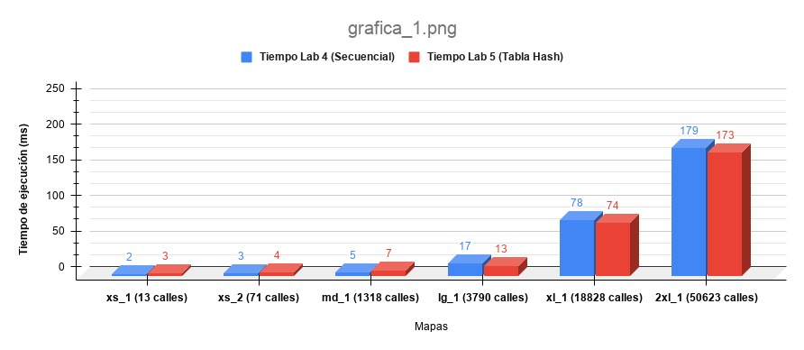
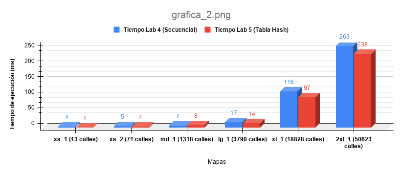
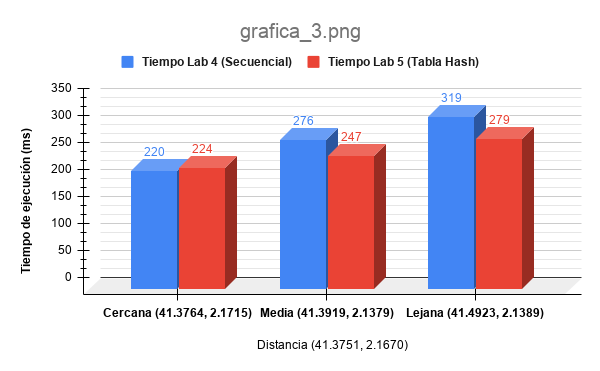
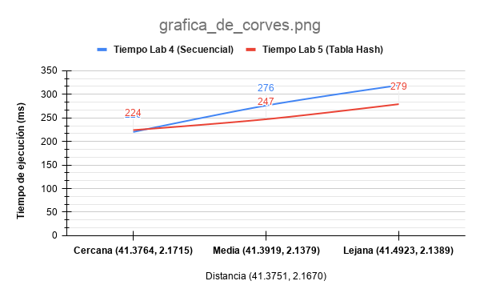

# Report
## 1. Runtime complexity: initializing the intersections map

La función `build_street_graph` recorre todos los segmentos de calle una vez para construir la tabla hash del grafo. Si **n** es el número de segmentos, el bucle principal ejecuta **n** iteraciones, llamando dos veces a `add_street_to_node` por segmento (una por cada extremo), lo cual es una constante.

Dentro de `add_street_to_node`, hay un segundo bucle que recorre la cadena de colisiones del bucket correspondiente. En el caso medio, con HASH_SIZE = 10.000 y una distribución uniforme de nodos, la cadena es corta y este bucle cuesta **O(1)**. En el peor caso, si todos los nodos caen en el mismo bucket, la cadena tiene **n** elementos y el bucle cuesta **O(n)**. Como esto ocurre en cada una de las **n** iteraciones del bucle principal, el coste total es O(n) × O(n) = **O(n²)**.

Por tanto, la complejidad en el caso medio es **O(n)** y en el peor caso es **O(n²)**. Aunque en el peor caso sea **O(n²)**, no es probable que ocurra en la práctica, porque la función hash distribuye los nodos de forma uniforme entre los buckets.

- **Caso medio:** O(n) 
- **Peor caso:** O(n²)

## 2. Runtime complexity: finding the coordinates of a street or place given the name

Para buscar un lugar por nombre, el código recorre la lista de places entera comparando nombres, no para aunque encuentre uno *(busca duplicados)*. Por lo tanto, siempre cuesta lo mismo independientemente del caso, **O(P)**, donde **P** es el número de places.

Para buscar una calle por nombre, recorre la lista de houses comparando calle normalizada + número. Si encuentra la casa exacta, para gracias al `break`. En el caso medio, encontraría la casa aproximadamente a la mitad de la lista, costando **O(H/2)**, que simplificado sigue siendo **O(H)**. En el peor caso recorrería toda la lista y costaría **O(H)**, donde **H** es el número de houses. En el mejor caso la casa que buscamos es la primera de la lista y costaría **O(1)**.

- **Búsqueda por place:**
    - **Mejor caso:** O(P)
    - **Caso medio:** O(P)
    - **Peor caso:** O(P)

- **Búsqueda por street:**
    - **Mejor caso:** O(1)
    - **Caso medio:** O(H)
    - **Peor caso:** O(H)

## 3. Runtime complexity: BFS path-finding algorithm

La función `compute_bfs` implementa un BFS sobre el grafo de intersecciones, que está representado como una tabla hash donde cada entrada es una lista enlazada de intersecciones que comparten ese hash. En el bucle exterior cada nodo se desencola como máximo una vez gracias al `is_visited`, por lo tanto el bucle se ejecutará **O(V)** veces, donde **V** es el número de nodos/intersecciones.

En el bucle interior (*vecinos*) por cada nodo se recorre la lista de vecinos, es decir todas sus aristas. Sumando todos los nodos, se visita cada arista una vez en total, por lo tanto el bucle interior se ejecutará **O(E)** veces, donde **E** es el número de aristas.

Por último, `is_visited` y `mark_visited` son operaciones **O(1)** de media, por lo tanto no afectan a la complejidad.

En resumen, la complejidad del algoritmo es **O(V + E)**.

- **Mejor caso:** O(1) — el destino es el primer nodo explorado
- **Caso medio:** O(V + E)
- **Peor caso:** O(V + E)

### 5. Estudio de Rendimiento: Latencia en la Búsqueda de Calles Conectadas
#### Datos Experimentales (Media de 5 ejecuciones)
| Mapa | Número de calles | Tiempo Lab 4 (Secuencial) | Tiempo Lab 5 (Tabla Hash) |
| :--- | :--- | :--- | :--- |
| **xs_1** | 13 | 2,0 ms | 3,0 ms |
| **xs_2** | 71 | 3,0 ms | 4,0 ms |
| **md_1** | 1.318 | 5,0 ms | 7,0 ms |
| **lg_1** | 3.790 | 17,0 ms | 13,0 ms |
| **xl_1** | 18.828 | 78,0 ms | 74,0 ms |
| **2xl_1** | 50.623 | 179,0 ms | 173,0 ms |

#### Gráfica Comparativa

### Análisis de los resultados
1. **Eficiencia de acceso:** La gráfica muestra que a medida que el volumen de datos aumenta (número de calles), la implementación con **Tabla Hash (LAB 5)** resulta ser más eficiente que la **Búsqueda Secuencial (LAB 4)**. Esta diferencia llega a ser más notable conforme el mapa es más grande (como en el caso de `xl_1` y `2xl_1`), donde el acceso directo a la tabla evita el coste de recorrer toda la lista enlazada cada vez que se debe consultar una intersección.

2. **Overhead:** En mapas pequeños (`xs_1`, `xs_2` y `md_1`), el tiempo total de ejecución en el caso del **LAB 5** puede ser muy similar o superior al del **LAB 4**. Esto se debe al *overhead*: la función `build_street_graph` requiere reservar memoria (`malloc`) y estructurar el grafo de la tabla hash antes de comenzar las búsquedas. Este coste fijo es irrelevante en mapas grandes, pero puede ser notable en mapas más pequeños.

3. **Conclusión:** Aunque el tiempo de ejecución medido incluye la carga de datos en memoria, la mejora de rendimiento del **LAB 5** respecto al **LAB 4** en los mapas más grandes demuestra que la estructura de datos (Tabla Hash) es superior para sistemas escalables.

### 6. Estudio de Rendimiento: Latencia en la Navegación
#### Datos Experimentales (Media de 5 ejecuciones)
| Mapa | Número de calles | Tiempo Lab 4 (Secuencial) | Tiempo Lab 5 (Tabla Hash) |
| :--- | :--- | :--- | :--- |
| **xs_1** | 13 | 4,0 ms | 1,0 ms |
| **xs_2** | 71 | 5,0 ms | 4,0 ms |
| **md_1** | 1.318 | 7,0 ms | 8,0 ms |
| **lg_1** | 3.790 | 17,0 ms | 14,0 ms |
| **xl_1** | 18.828 | 116,0 ms | 97,0 ms |
| **2xl_1** | 50.623 | 263,0 ms | 238,0 ms |

#### Gráfica Comparativa

#### Análisis de lso resultados
1. **Eficiencia:** A diferencia de la búsqueda simple, el cálculo de una ruta requiere explorar múltiples intersecciones. En el Lab 4, cada paso del algoritmo de búsqueda requería recorrer la lista de calles completa para encontrar los segmentos conectados. En el Lab 5, con la **Tabla Hash**, los segmentos conectados se obtienen mediante acceso directo, optimizando la ejecución del algoritmo `compute_bfs`.

2. **Overhead** Se observa que en mapas pequeños, el tiempo de ejecución de ambos laboratorios es similar. Esto se debe al costo inicial de construir la tabla hash (`build_street_graph`). En cambio en mapas de gran escala (`xl_1`, `2xl_1`), el no tener que realizar búsquedas secuenciales en cada iteración del BFS, mejora la eficacia y rapidez de ejecución.

3. **Conclusión:** Los resultados demuestran que la Tabla Hash mejora el acceso puntual a datos. La reducción de la latencia en los mapas más grandes demuestra que la implementación del Lab 5 es más eficiente para sistemas de gran escala.

### 7. Estudio de Rendimiento: Latencia según la Distancia
#### Datos Experimentales (Media de 5 ejecuciones)
| Escenario (41.3751, 2.1670) | Destino (Lat, Lon) | Lab 4 (Secuencial) | Lab 5 (Tabla Hash) |
| :--- | :--- | :--- | :--- |
| **Cercana** | 41.3764, 2.1715 | 220,0 ms | 224,0 ms |
| **Media** | 41.3919, 2.1379 | 276,0 ms | 247,0 ms |
| **Lejana** | 41.4923, 2.1389 | 319,0 ms | 279,0 ms |

#### Gráfica Comparativa

#### Gráfica Comparativa de Curvas

#### Análisis de los resultados
1. **Escalabilidad:** El algoritmo BFS explora nodos en capas concéntricas desde el origen. Contra mayor sea la distancia, el número de vértices y aristas visitadas mas crecera. En el Lab 4, cada consulta de vecinos tiene un coste **O(N)** (búsqueda en lista), lo que dificulta el rendimiento total a medida que la ruta se alarga. En el Lab 5, la **Tabla Hash** hace que el BFS tenga un coste de acceso de **O(1)**, acelerando el proceso del programa.

2. **Justificación del ajuste de curva:** El tiempo de ejecución sigue una curva ascendente, cuanta más distancia cubrimos, el número de calles a procesar crece rápidamente. La curva del **Lab 4** es más pronunciada porque su tiempo de búsqueda aumenta drásticamente con cada nueva calle procesada. En cambio, la curva del **Lab 5** es más plana porque la Tabla Hash permite realizar las consultas de manera constante, independientemente de cuántas calles tenga el mapa en total.

3. **Conclusión:** El uso de una tabla hash es la mejor opción en mapas de gran escala. A pesar de que en rutas cortas el **overhead** de la estructura hash puede igualar e incluso superar los tiempos con una busqueda secuencial simple, a distancias medias y largas, la optimización de la tabla hash acelear el proceso y crea un gran diferencia con la busqueda secuencial simple.